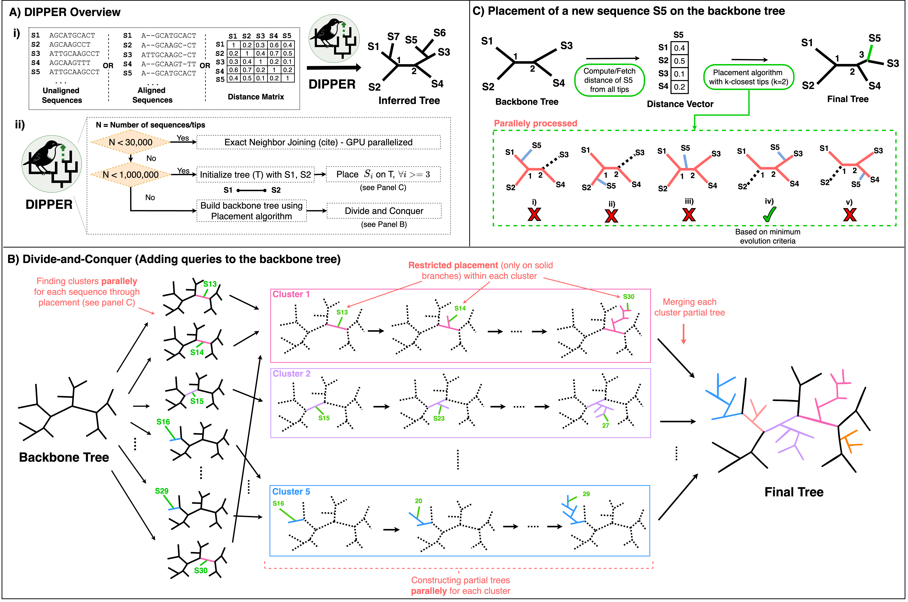

# <b>Welcome to DIPPER Wiki</b>
<div align="center">
    
</div>

## <b>Introduction</b> 
### <b>Overview</b><a name="overview"></a>
DIPPER (**DI**stance-based **P**hylogenetic **P**lac**ER**) is an ultrafast tool designed to reconstruct ultralarge phylogenies. 

<div align="center">
    <div><b>Figure 1: Overview of DIPPER algorithm</b></div>
    
</div>

### <b>Key Features</b>

#### TBA

<a name="install"></a>
## <b>Installation Methods</b>

NOTE: DIPPER is currently supported on systems with <b>NVIDIA GPUs only</b>. Support for other platforms including AMD GPUs, CPU-only for x86-64 and ARM64 architecture will be added soon, stay tuned!

### 1. <a name="dockerimage"></a> Using Docker Image
To use DIPPER in a docker container, users can create a docker container from a docker image, by following these steps
#### i. Dependencies
1. [Docker](https://docs.docker.com/engine/install/)
#### ii. Pull and build the DIPPER docker image from DockerHub
```bash
## Note: If the Docker image already exist locally, make sure to pull the latest version using 
## docker pull swalia14/dipper:latest

## If the Docker image does not exist locally, the following command will pull and run the latest version
docker run -it --gpus all swalia14/dipper:latest
```
#### iii. Run DIPPER
```bash
# Insider docker container
dipper --help
```

### 2. Using DockerFile <a name="dockerfile"></a>
Docker container with preinstalled DIPPER program can also be built from a Dockerfile by following these steps.

#### i. Dependencies
1. [Docker](https://docs.docker.com/engine/install/)
2. [Git](https://git-scm.com/downloads)

#### ii. Clone the repository and build a docker image
```bash
git clone https://github.com/TurakhiaLab/DIPPER.git
cd DIPPER/docker
docker build -t dipper .
```
#### iii. Build and run the docker container
```bash
docker run -it --gpus all dipper
```
#### iv. Run DIPPER
```bash
# Insider docker container
dipper --help
```

### 3. <a name="script"></a> Using installation script (requires sudo access)  

Users without sudo access are advised to install DIPPER via [Docker Image](#dockerimage) or [Dockerfile](#dockerfile).

**Step 1:** Clone the repository
```bash
git clone https://github.com/TurakhiaLab/DIPPER.git
cd DIPPER
```
**Step 2:** Install dependencies (requires sudo access)

DIPPER depends on the following common system libraries, which are typically pre-installed on most development environments:
```bash
- wget
- cmake 
- build-essential 
- libboost-all-dev
- libtbb-dev
```
For Ubuntu users with sudo access, if any of the required libraries are missing, you can install them with:
```bash
sudo apt install -y wget cmake build-essential libboost-all-dev  libtbb-dev
```

**Step 3:** Build DIPPER

```bash
cd install
chmod +x installUbuntu.sh
./installUbuntu.sh
cd ../
```

**Step 4:** The DIPPER executable is located in the `bin` directory and can be run as follows:
```bash
cd bin
./dipper --help
```

## <a name="Run DIPPER"></a> **Run DIPPER**

### Functionalities
<div name="table1" align="center"> <b>Table 1:</b> List of functionalities supported by DIPPER </div>

| **Option**               | **Description**                                                                                                  |
| ------------------------ | ---------------------------------------------------------------------------------------------------------------- |
| `-i`, `--input-format`   | Input format:<br>`d` - distance matrix<br>`r` - raw sequences<br>`m` - MSA                                       |
| `-o`, `--output-format`  | Output format:<br>`d` - distance matrix<br>`t` - phylogenetic tree                                               |
| `-I`, `--input-file`     | Input file path:<br>PHYLIP for distance matrix, FASTA for MSA or raw sequences                                   |
| `-O`, `--output-file`    | Output file path                                                                                                 |
| `-m`, `--algorithm`      | Algorithm selection:<br>`0` - default<br>`1` - force placement<br>`2` - force NJ<br>`3` - divide-and-conquer     |
| `-p`, `--placement-mode` | Placement mode:<br>`0` - exact<br>`1` - k-closest (default)                                                      |
| `-k`, `--kmer-size`      | K-mer size (Valid range: 2–15, Default: 15)                                                                      |
| `-s`, `--sketch-size`    | Sketch size (Default: 10,000)                                                                                    |
| `-r`, `--threshold`      | Erroneous k-mer threshold (Default: 1)                                                                           |
| `-d`, `--distance-type`  | Distance type:<br>`1` - uncorrected<br>`2` - JC<br>`3` - Tajima-Nei<br>`4` - K2P<br>`5` - Tamura<br>`6` - Jinnei |
| `-a`, `--add`            | Add query to a backbone tree using k-closest placement                                                           |
| `-t`, `--input-tree`     | Input backbone tree in Newick format                                                                             |
| `-h`, `--help`           | Show help message                                                                                                |

!!!Note
    All the files used in the examples below can be found in the `DIPPER/dataset`.

Enter into the build directory (assuming `$DIPPER_HOME` directs to the DIPPER repository directory)  
```bash
cd $DIPPER_HOME/bin
./dipper -h
```
#### **Default Mode**  
Generate phylogeny by providing an unaligned sequence file.  

### Construct phylogeny from raw sequences
Usage syntax
```bash
./dipper -i r -o t -I <path to unaligned sequences FASTA file> -O <path to output file>
```
Example
```bash
./dipper -i r -o t -I ../dataset/input.unaligned.fa -O tree.nwk
```

### Construct phylogeny from aligned sequences
Usage syntax (using JC model)
```bash
./dipper -i m -o t -d 2 -I <path to aligned sequences FASTA file> -O <path to output file>
```
Example
```bash
./dipper -i m -o t -d 2 -I ../dataset/input.aligned.fa -O tree.nwk
```

### Construct phylogeny from distance matrix
Usage syntax 
```bash
./dipper -i d -o t -I <path to distance matrix PHYLIP file> -O <path to output file>
```
Example
```bash
./dipper -i d -o t -I ../dataset/input.phy -O tree.nwk
```

##  <a name="contribution"></a> Contributions
We welcome contributions from the community to enhance the capabilities of **DIPPER**. If you encounter any issues or have suggestions for improvement, please open an issue on [DIPPER GitHub page](https://github.com/TurakhiaLab/DIPPER/issues). For general inquiries and support, reach out to our team.

##  <a name="cite"></a> Citing DIPPER
TBA.
